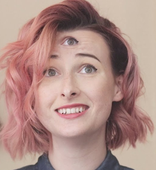
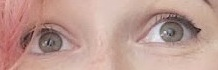
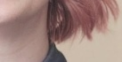
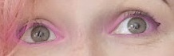
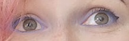
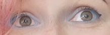

# Greasepaint

A python library to manipulate the faces. Think snapchat but weirder.

## Examples

 

### Reminders for self

    avconv -threads auto -y -r 30 -q:v 1     %06d.jpg    -i Reacting_To_People_Who_Have_Smash_Or_Passed_Me-m0ttpozYW14.mp4